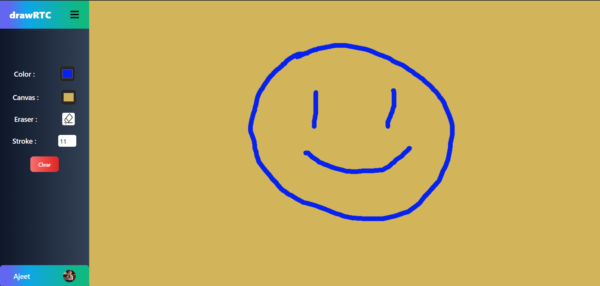

# drawRTC : A Real-Time Drawing app.

A real-time collaboration project to draw with your friends.

## Demo
(click on the thumbnail below)

## Instructions

### Set Up the Project Locally

#### If you are cool like me, then set up using docker

1. Run `docker-compose build` in the root directory of the project
2. Once build is successful, run `docker-compose up -d`
3. Now your frontend would be running on `localhost:5173` and backend on `localhost:8000`
4. Enjoy drawing !

#### Set Up manually

1. cd into the api folder `cd api`
2. install dependencies `npm install`
3. then cd into the client `cd client`
4. install dependencies `npm install`

In order to start drawing, execute these commands.

first start the server

1. `cd api`
2. `npm run server`

then start the client

1. `cd client`
2. `npm run dev`
3. go to `http://localhost:5173/`
4. draw and have fun!

Crafted by [Ajeet](https://x.com/ajeetonx) pratap singh